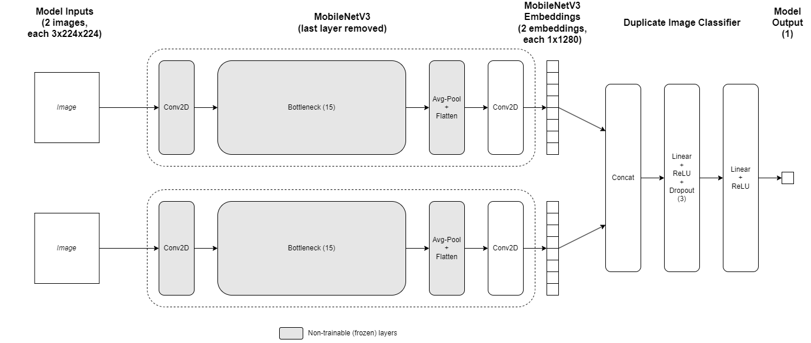

# SameSpace: Duplicate Image Detection using Siamese Neural Networks

We take many, many photos. These photos are stored on our devices and can be time-consuming to clean up. At times we may forgo choosing photos, instead uploading all of them online for sharing. This can create issues for the recipient, who will be the same photo multiple times. In a non-trivial scenario, viewing accommodation photos can be frustrating when there are duplicates of the same space, affecting the user experience.

On a technical angle, duplicate photos is a double edged sword. On one hand, it can be useful in having multiple sources of information that serves as evidences for information retrieval systems. (Paul, 2021) On the other hand, it is a concern when it comes to removing copyrighted images (Podolak, 2021), optimising storage costs on the cloud, or when using them for machine learning (Lee, 2021).

## Project Objective

SameSpace is a deep learning model that detects if two home images are similar, utilising transfer learning in a Siamese network developed using PyTorch.

SameSpace can be embedded into systems to detect duplicate images of accommodation spaces, useful in cases such as:

- Reducing candidate images during image curation
- Optimising (cloud) storage space
- Computer vision model training

## Dataset

The Airbnb Duplicate Image Dataset by Sunkaraneni et al., hosted on Kaggle, is used for model training and validation. (Sunkaraneni et al., 2019) The authors collected images that show the same space/room, and tagged them in the `<city>_<room_id>_<match_number>.jpg` format. This meant that images with the same `city` and `room_id` can be inferred as duplicate images. 

The images are organised in separate `Training Data` and `Test Data` folders. In each folder, there are subfolders for each space type (e.g. living room, kitchen) but those are not used.

### Feature Engineering

The target variable (label) is derived from the image filename, where the filename is split and the `city` and `room_id` are retrieved and matched. Duplicate images have the same `city` and `room_id`.

The training and validation dataset is created by first retrieving all image paths, then pairing them up and deriving the target. This amounts to 3,765 duplicate (positive) and 394,396 non-duplicate (negative) samples in the training dataset, with an extreme class imbalance.

The class imbalance presents an issue on model training - the model does not generalise well and results skew towards the negative class. The negative class can be simply downsampled closer to the positive class, but this will lead to a small training dataset. Upsampling the positive class and downsampling the negative class was done instead, and will be detailed in the following paragraphs.

Upsampling is done on the positive class through image transformations - horizontal flipping and rotation by 5 degrees. These transformations will then applied in all permutations (e.g. image 1 rotated and image 2 horizontally flipped then rotated). The augmented images will then be presented as new images to the model, increasing the positive samples by a factor of 16 to 60,240. It is worth noting that to improve memory efficiency, these transformations will not be immediately applied.

Downsampling on the negative class is performed through weighted sampling. The weights are engineered to be inversely exponential to the similarity score of each image pair. First, the weighted hash of each image (downsized to 256x256) is calculated (using ImageHash). Next, the similarity score (hamming distance) between each non-duplicate pair is calculated. (Levengood, 2020) Lastly, the weights used for sampling is calculated by taking the inverse exponential function of the similarity score: $\frac{1}{e^{x}}$ where $x$ is the similarity score. These weights are then used to sample without replacement with a seed of 0 for consistency across runs. The same number of non-duplicate pairs (60,240) is being sampled.

With the dataset in place, all images are loaded into memory, with the resize and normalisation transformations applied in accordance to the input specifications for pre-trained models on PyTorch. (PyTorch, 2022)

The aforementioned steps are applied separately to both training and validation datasets with the `DuplicateImageDataset` class that inherits `torch.utils.data.Dataset`. The transformations used for upsampling are applied in `__getitem__()`.

### Data Sample

[comment]: <> (TODO: Data sample diagram)

## Model Architecture

SameSpace adopts a Siamese network architecture consisting of two MobileNetV3 large models, each with their last layer removed. The layers prior to the last convolution layer are frozen. The outputs of the MobileNetV3 models are concatenated and passed through the duplicate image classifier.

The model’s output is a nested list of floating point numbers, which will then be passed through the sigmoid function to return probabilities between 0 and 1. The probabilities are then binned into two equal bins for evaluation.

MobileNetV3 is selected for transfer learning as it is appropriate for the problem, and is designed to be used in resource limited scenarios. This allows SameSpace to be deployed and run (inference) on a large variety of platforms.

### Features and Hyperparameters

SameSpace is trained with the root mean square propagation (RMSProp) optimizer with the following hyperparameters:
- Learning rate `lr`
- Smoothing constant `alpha`

In addition, there are 3 dropout rates `dropout1`, `dropout2` and `dropout3` each representing the number of neurons to drop after each linear and ReLU layers in the duplicate image classifier.

The `global_batch_size` is set to 64, `epochs` set to 30 and `max_trials` set to 128. The searcher algorithm used is `adaptive_asha`.

[comment]: <> (TODO: Search space table)

## Running the Training Job

Before running training job, a Kaggle API key is required to download the dataset. (Cherian, 2020) This is required as the directory size will be more than 96MB with the dataset. (Determined AI, 2023)

- Login to Kaggle and go to the account tab https://www.kaggle.com/settings/account
- Click "Create New Token"
- Download the `kaggle.json` file and move it to the repository's root directory (same folder as `data.py` and `model_def.py`)

The dataset will then be downloaded into the `data` folder in `__init__()` in `model_def.py`. Then, the following commands are run in order to start the training job on Determined Cloud:

- `export DET_MASTER=<master ip>`
- `det auth login`
- `det experiment create adaptive.yaml .`

## Best Metrics from Determined Web UI

[comment]: <> (TODO: Results screenshot)

## Evaluation Metrics

The metrics used to evaluate the model are binary cross-entropy loss `BCELoss` and accuracy calculated from the validation dataset. 

The metric used for the searcher to determine the best model is `validation_loss`.

## Evaluation Results

[comment]: <> (TODO: Model test results)

## Reproducing Evaluation Results

The evaluation results can be reproduced by loading the PyTorch model weights, running the validation dataset through the model, and calculating the binary cross-entropy loss.

## References

Cherian, 2020. Kaggle API – The Missing Python Documentation: https://technowhisp.com/kaggle-api-python-documentation/

Determined AI, 2023. Prepare Data: https://docs.determined.ai/0.19.10/training/load-model-data.html

Lee, 2021. A Scalable Solution to Detect Duplicate Images: https://medium.com/mlearning-ai/a-scalable-solution-to-detect-duplicate-images-97d431c2726d

Levengood, 2020. Determining how similar two images are with Python + Perceptual Hashing: https://lvngd.com/blog/determining-how-similar-two-images-are-python-perceptual-hashing/

Paul, 2021. Near-duplicate image search: https://keras.io/examples/vision/near_dup_search/

Podolak, 2021. How to Create a Duplicate Image Detection System: https://towardsdatascience.com/how-to-create-a-duplicate-image-detection-system-a30f1b68a2e3 

PyTorch, 2022. torchvision.models: https://pytorch.org/vision/0.11/models.html

Sunkaraneni et al., 2019. AirBnB Duplicate Image Dataset: https://www.kaggle.com/datasets/barelydedicated/airbnb-duplicate-image-detection

Kaggle API – The Missing Python Documentation: https://technowhisp.com/kaggle-api-python-documentation/